# 预注册guideline

Assignee: Dongyu 
Status: In progress
Project: @SCMD在线资源库 

# What’s OFS

## **Open Science Framework, OSF**

[OSF](https://osf.io/)

> 一个免费开源的在线平台，致力于支持研究者开展开放的科学研究。它提供了一个全面的项目管理工具，包括数据存储、版本控制、共享和协作等功能。同时，它还能够集成各种类型的研究资源，使得项目成果更加易于共享和发现。
使用OSF平台，研究者们可以轻松创建和管理自己的研究项目，并邀请其他人一起协作和贡献，比如同事、合作者、审稿人等等。
另外，OSF平台还支持与其他在线平台和工具进行集成，例如GitHub、Dropbox等，进一步扩展了平台的功能和灵活性。
> 

## 主要功能

### OSF Preprints：在线预印本

研究者可以在提交同行评审之前，将他们的最新研究成果发布在OSF平台上，让其他人更快地看到并进行评价互动。这个功能能够让大家更快地分享他们的最新研究成果，让科学研究变得更加开放和透明。

优点：

1. **开放性**：OSFPREPRINTS是一个免费开放的平台，任何人都可以在上面发布和查看预印本。
2. **快速性**：预印本发布不需要等待同行评审，能够更快地发布和传播自己的研究成果。
3. **可追溯性**：OSFPREPRINTS平台会为每一篇预印本生成唯一的DOI编号，确保每篇预印本都能被准确引用和追踪。
4. **支持交流**：平台上的预印本可以通过评论、分享等方式与其他研究者进行交流和讨论，有利于促进学科领域学术交流和合作。
5. **兼容性**：OSFPREPRINTS平台支持多种文件格式，包括PDF、HTML、LaTeX等等，方便用户按照自己的需求进行上传和发布。

> 💡可以根据自己需要上传文档或者直接点击自己研究领域查看其他学术工作者的预印本文件，也可以通过这个平台看看自己的想法是不是和其他人重合了，避免无用功。
> 

### OSF Meetings：在线会议平台

顾名思义

**功能：**

1. **会议管理**：用户可以在OSFMEETINGS平台上创建和管理自己的会议，包括会议议程、参会人员、会议资料等等。
2. **视频会议**：平台支持在线视频会议功能，用户可以通过平台进行远程会议和协作，有利于解决地理位置限制的问题。
3. **群组协作**：用户可以在平台上创建和加入不同的研究群组，与其他研究者进行协作和交流，有利于推动自身科学研究的进展。
4. **会议记录**：平台支持会议记录功能，用户可以将会议记录和资料保存在平台上，方便后续查看和分享。

### OSF Institutions：私人的OSF平台

机构或组织可以创建一个私人的OSF平台，以便更好地管理和分享他们的研究资源。这个功能可以让机构和组织更好地保护和管理他们的研究数据和隐私。

**功能：**

1. **数据管理**：平台可以帮助科研机构对研究数据进行统一管理，包括数据上传、存储、共享、备份等，有利于提高研究数据的可靠性和可重复性。
2. **研究协作**：平台可以帮助科研机构进行研究协作，包括研究项目管理、团队协作、数据共享等，有利于促进研究的合作和交流。
3. **研究评估**：平台可以帮助科研机构进行研究评估和监管，包括研究成果评估、数据管理评估等，有利于提高研究质量和透明度。
4. **开放性**：OSFinstitutions平台是一个开放的平台，任何科研机构都可以加入和使用。
5. **安全性**：平台采用多层安全机制，保证研究数据的安全和隐私。

### OSF Registries：预注册⭐

可以防止研究者在研究过程中进行非科学标准的修改（例如，为了数据结果而更改数据样本等等），同时也可以让其他人查看和审阅整个研究计划（让审稿人和读者知道自己在收数据之前就已经想好了假设和研究设计以及预期结果）。

**功能：**

1. **注册表创建**：平台支持用户创建各种类型的注册表，包括研究协议、数据集、工具等等，有利于记录和管理各种类型的研究信息。
2. **注册表管理**：用户可以在平台上管理自己创建的注册表，包括添加、编辑、删除、共享等功能，有利于更好地管理研究信息(如果创建完成，每一次的修改都是会留下记录并公开给有访问权限的每个人，做到项目完全透明)。
3. **注册表发现**：用户可以在平台上发现和浏览其他研究者创建的注册表。
对于一些不熟悉OSF平台的读者朋友们，OSF平台的操作可能会有些困难，需要一些时间来熟悉和掌握。

> 更加详细的内容可见：
> 
> 
> [科研工具 | 科研必会的OSF网站攻略分享来啦!](https://mp.weixin.qq.com/s/Pm3SFG123K2KnQmhPpHJcg)
> 

# 什么是预注册？为什么要预注册？

### ❓什么是预注册

请读👉

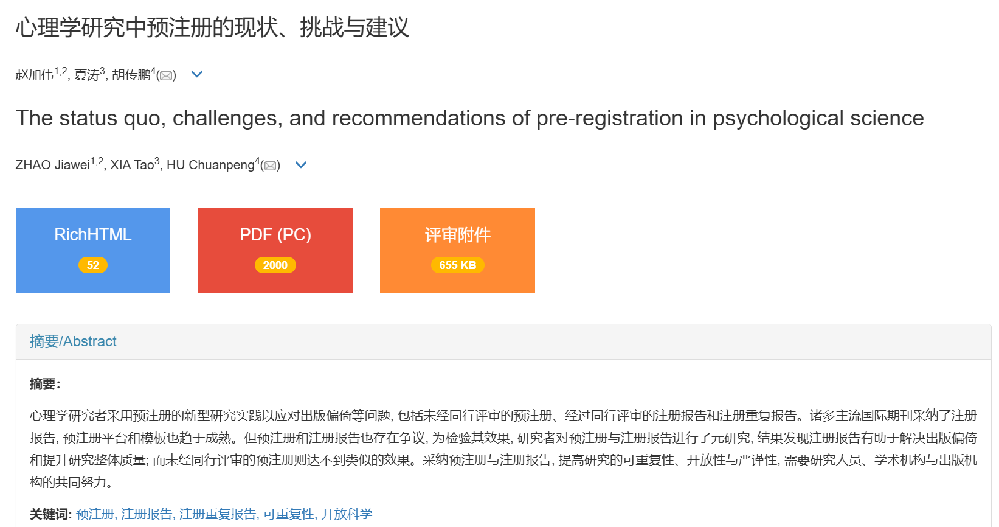

> 赵加伟, 夏涛, 胡传鹏. (2024). 心理学研究中预注册的现状、挑战与建议. *心理科学进展 , 32*(5), 715-727.
[心理学研究中预注册的现状、挑战与建议](https://journal.psych.ac.cn/xlkxjz/CN/10.3724/SP.J.1042.2024.00715)
> 

### ❓为什么要预注册

👆除上面所说之外，随着开放科学在我国的推广，越来越多的期刊在投稿时询问有没有进行过预注册（如*心理学报*）

> 💡注：临床干预或实验室实验, 建议在收集数据前预注册(pre-register)。也鼓励其他实验研究预注册。预注册要求写出所有的研究假设及其支持, 以及实验/干预的详细过程和步骤。本期刊的预注册网站是 [https://os.psych.ac.cn/preregister](https://os.psych.ac.cn/preregister) (使用说明书见本刊网站“下载中心”)或[https://osf.io/](https://osf.io/) 或[https://aspredicted.org/](https://aspredicted.org/)。如果您的研究有预注册, 会显著增加被录用的机会。预注册的重要性可参考[https://osf.io/5awp4/](https://osf.io/5awp4/) 

# 手把手教你预注册😎

1. 注册OSF账号
2. 主页右上角，在下拉菜单中选择“Registration”选项，进入
OSF**REGISTRIES**平台。

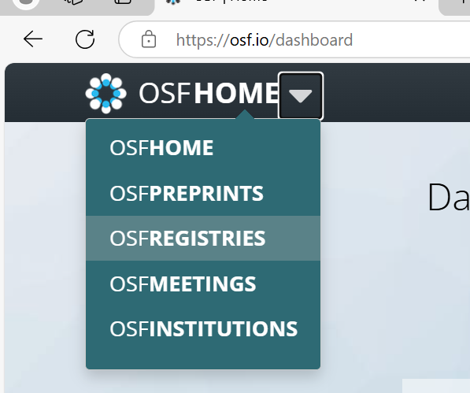

1. “Add New”

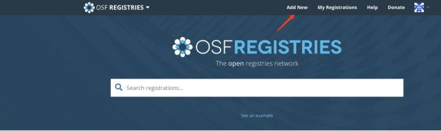

直接点击“Create draft”即可，如果你有其他需要可以点击列表选择

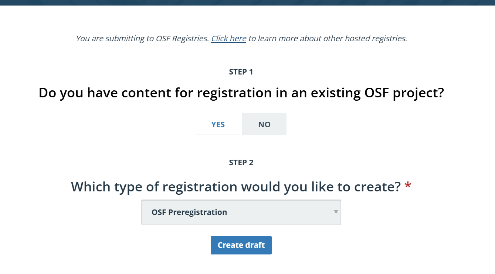

1. 在注册表的编辑页面中，输入研究的相关信息，如研究题目、研究设计、研究目的等。
   
    在“Preregistration”部分中，填写研究的预注册信息，如研究假设、操作定义、数据分析计划等。可以根据自己的研究设计自由填写。
    
    填写顺序为：基础信息→研究本身信息(假设)→研究设计→样本信息→核心变量→统计分析计划→其他→总体预览
    
    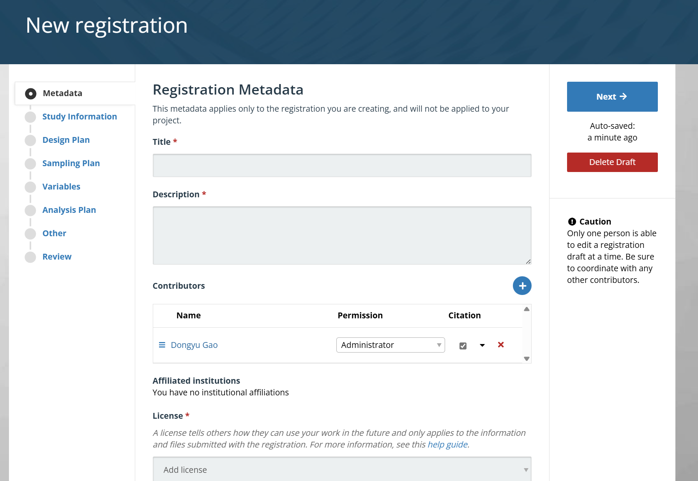
    
2. 基础信息填写如下图所示，然后按Next继续填写一下一部分内容(注意：**打星号*是必填信息，没打星号则可以选填**)。
   
    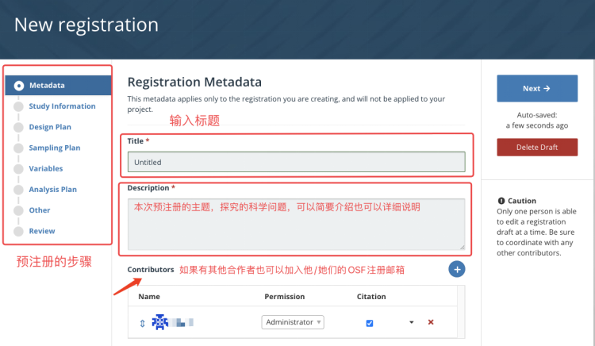
    
    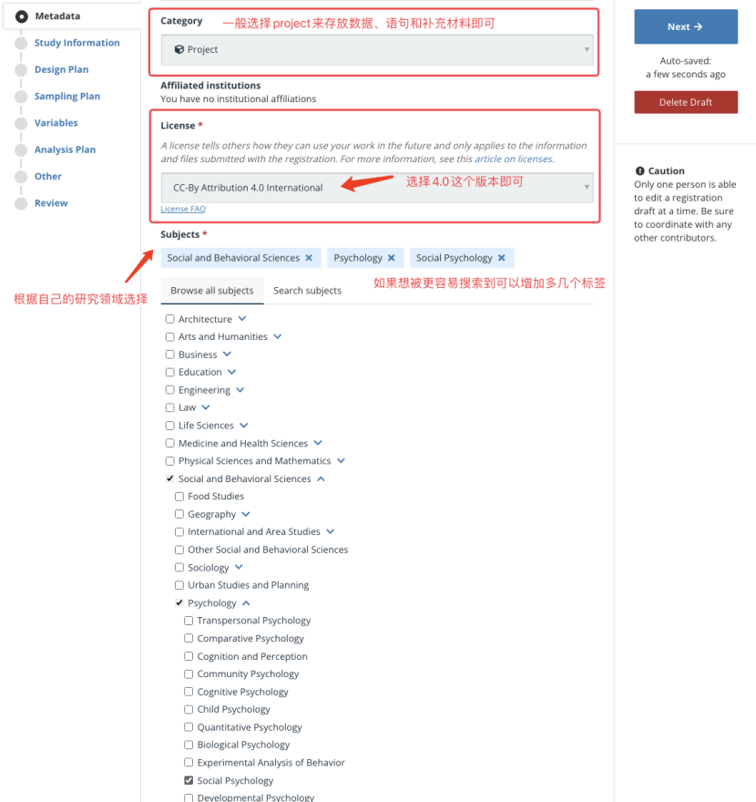
    
    1. 假设信息填写如下图所示，然后按Next继续填写一下一部分内容。
       
        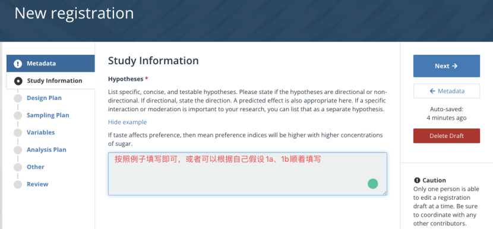
        
    2. 研究设计填写如下图所示，然后按Next继续填写一下一部分内容。
       
        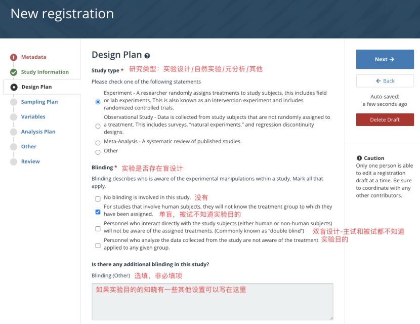
        
        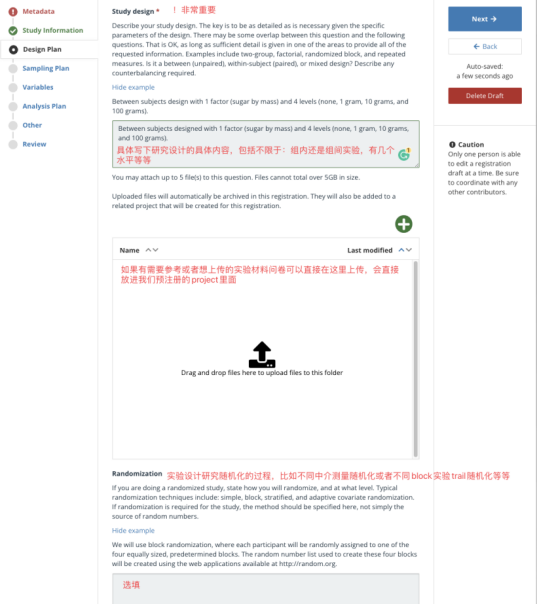
        
    3. 样本信息
       
        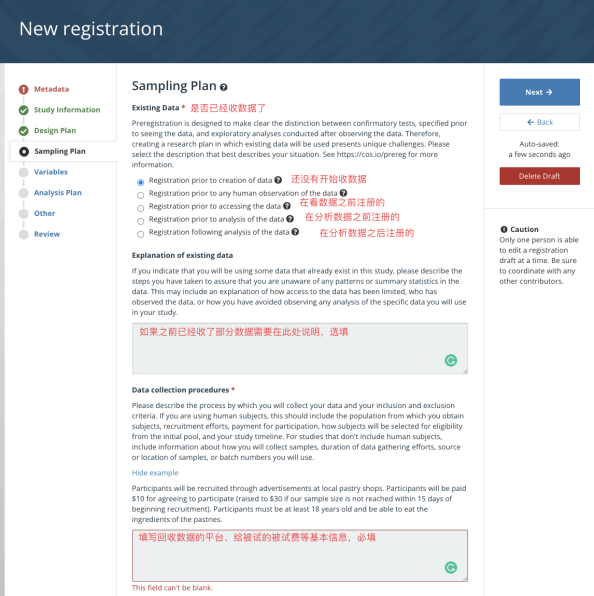
        
        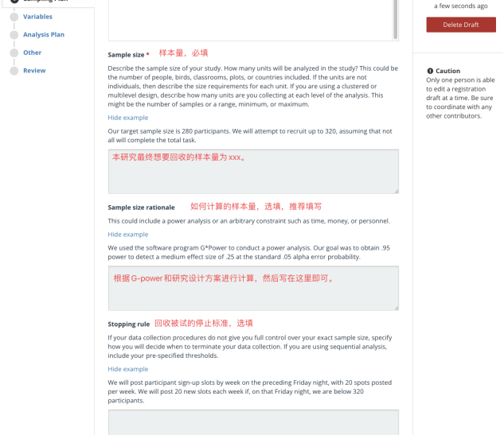
        
    4. 核心变量
       
        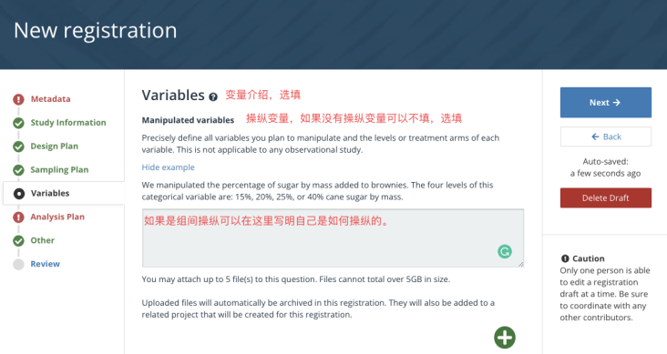
        
        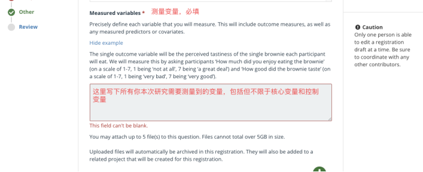
        
        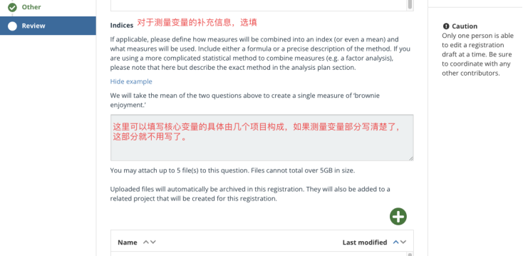
        
    5. 统计分析计划
       
        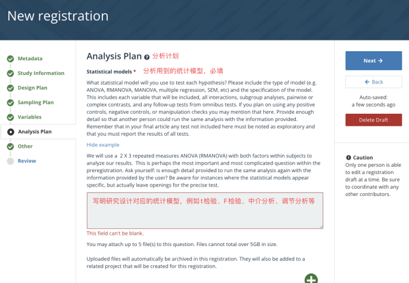
        
        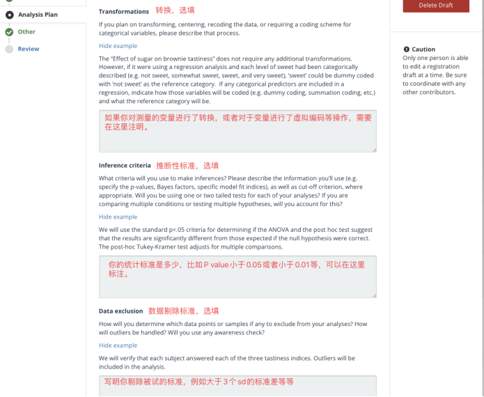
        
        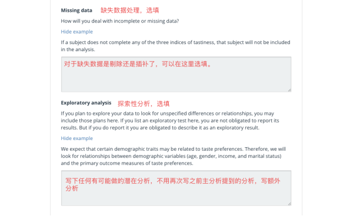
        
    6. 其他填写如下图所示，然后按“Review”就可以预览填写的所有内容
       
        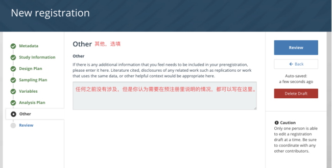
        
    7. 在保存成功后，预览完成后，点击页面顶部的“Register”按钮，注册研究（注意：**如果不确定可以先保存，注册之后无法修改！！！）**。注册好后，会获得一个注册的DOI号(独一无二)。
    
    > 参考自：
    > 
    > 
    > [mp.weixin.qq.com](https://mp.weixin.qq.com/s/RibJZMDsyDOBpJT-vhxipA)
    > 

# Template

[OSF Registries _ View Registration Drafts _ Review registration before submitting.pdf](./OSF_Registries___View_Registration_Drafts___Review_registration_before_submitting.pdf)

[AsPredicted预注册范本.pdf](./AsPredicted预注册范本.pdf)